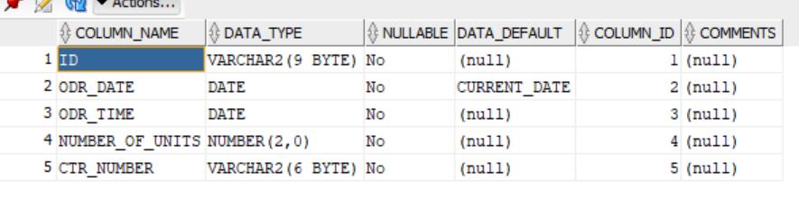
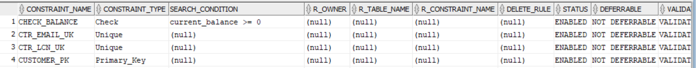

### Part 2

## Modifying a column

 

## Question 1

### desc orders;

 

## Question 2

~~~
ALTER TABLE orders
MODIFY odr_date DATE DEFAULT CURRENT_DATE;
~~~

 

## Question 3

 

## Adding a check constraint 

 

## Question 1

### desc customers;

 

## Question 2 

~~~
ALTER TABLE customers
ADD CONSTRAINT check_balance CHECK (current_balance >= 0);
~~~

 

## Question 3

~~~
desc orders
~~~

 

## Question 4

 

## Adding a column

 

## Question 1

### desc customers;

 

## Question 2

~~~
ALTER TABLE CUSTOMER
ADD mobile_phone VARCHAR(20);
~~~
 

## Question 3
### desc customers;

 

## Dropping a column

 

## Question 1

### desc customers;

 

## Question 2

~~~ 
ALTER TABLE customers
DROP COLUMN mobile_phone;
~~~

 

## Question 3

desc customers;

