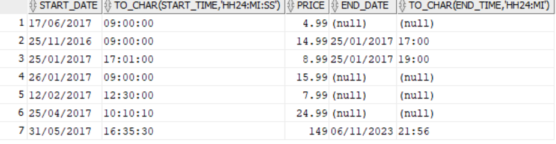
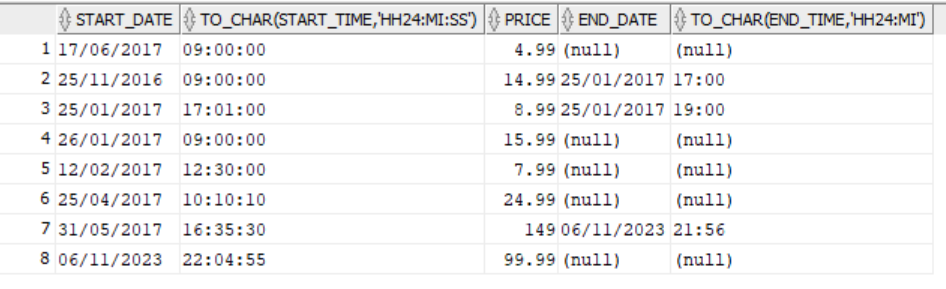
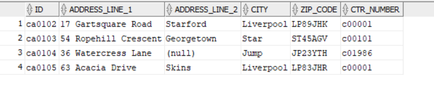

# Section 6 Lesson 4 Exercise 1

## Part 2 Inserting Rows

## Question 1
 ~~~
INSERT INTO teams VALUES ('t004', 'Jets', 10, 5);
 ~~~

## Question 2
 ~~~
INSERT INTO CUSTOMERS(CTR_NUMBER,
EMAIL,
FIRST_NAME,
LAST_NAME,
PHONE_NUMBER,
CURRENT_BALANCE,
LOYALTY_CARD_NUMBER) VALUES ('c02001', 'brianrog@hootech.com', 'Brian', 'Rogers', '01654564898', -5, 'lc4587')4
 ~~~

## Question 3
 ~~~
INSERT INTO CUSTOMERS(CTR_NUMBER,
EMAIL,
FIRST_NAME,
LAST_NAME,
PHONE_NUMBER,
CURRENT_BALANCE,
LOYALTY_CARD_NUMBER) VALUES ('c02001', 'brianrog@hootech.com', 'Brian', 'Rogers', '01654564898', 50, 'lc4587')
 ~~~

# Section 6 Lesson 4 Exercise 2

## Part 1 Updating Rows to The System

## Question 1

## Question 2

 ~~~
UPDATE price_history
SET end_date = CURRENT_DATE, end_time = systimestamp
WHERE itm_number = 'im01101048' AND end_date IS NULL;
 ~~~

## Question 3

## Question 4

 ~~~
INSERT INTO PRICE_HISTORY (START_DATE, START_TIME, PRICE, ITM_NUMBER)
VALUES (CURRENT_DATE, SYSTIMESTAMP, 99.99, 'im01101048');
 ~~~

## Question 5

## Part 2 Deleting Rows From The System

## Question 1

 ~~~
DELETE FROM CUSTOMERS_ADDRESSES
WHERE ADDRESS_LINE_1 = '83 Barrhill Drive';
 ~~~

## Question 2

