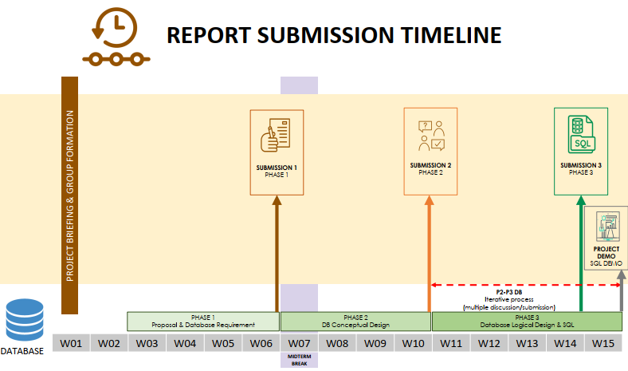
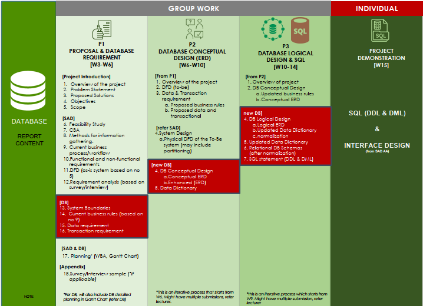

# PROJECT OVERVIEW   (DATABASE 20232024 – SEM 1)

- [DESCRIPTION](#description)  
- [PROPOSED SYSTEM REQUIREMENT](#proposed-system-requirement)  
- [PROJECT SUBMISSION TIMELINE](#project-submission-timeline)

## ** HIGHLY RECOMMENDED to do the project in the same group & case study with SECD2613 (SAD) **

### DESCRIPTION
- Form a group of 4 members (or a maximum of 5 members, only if allowed by lecturers). 
Your team must identify ONE system as a case study to be proposed for your team’s project. The system domain must be related to the xxx {lecturer to choose}. 

---

The proposed case study should be either a new system or an enhancement of the currently available system. The proposed case study can also be derived from two situations:   
a)	Manual or not fully computerized/automated systems yet,  
b)	Existing computerized/automated systems that are having problems.

---

### PROPOSED SYSTEM REQUIREMENT
Based on the requirements of the stakeholders, each group is required to propose a database system.

The proposed system must follow the requirements below:
1.	Fulfilled the project requirement.
Please refer to the DB project phases description for further instruction on the report and evaluation for each phase. The evaluation for the project will be based on the course project rubric.
2.	The proposed system must have at least FOUR (4) modules.
Each student in the group will be responsible for designing at least ONE module. This includes the analysis and design task of designing the module (Data Flow Diagram (DFD) and Entity Relation (ER) design). The module must be designed with consideration of the group’s proposed system. Each module should be able to be combined/merged to produce the main DFD (for the proposed system) and global data model (for the database) – refer figure below.
3.	Students will do a demo of the project in the Final Phase.
Students would need to demo:
A relational database schema, working query (DML) based on the DDL design of the project and related to the interface (from SAD).

---

### PROJECT SUBMISSION TIMELINE
*This is just a suggested timeline, please refer to your section lecturers for further instruction    
    

